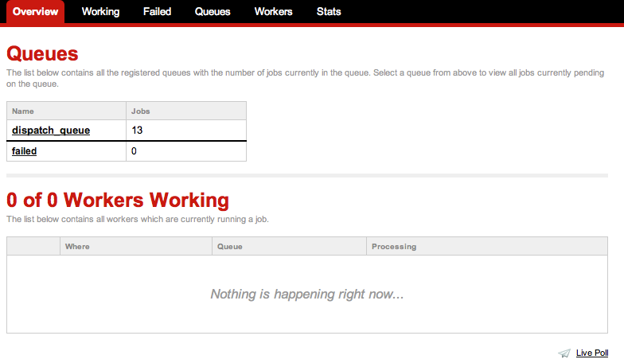

!SLIDE quote

# Concepts

!SLIDE

## Hot Spot

```ruby
class PostsController < ApplicationController

  # ... other actions

  def create
    post = Post.create(params[:post],:user => current_user)

    if post.twitter
      current_user.twitter.update post.message
    end

    if post.facebook
      current_user.facebook.put_wall_post post.message
    end

    redirect_to user_posts_path(current_user)
  end

end
```

!SLIDE

## A Resque Job

```ruby
class Poster
  @queue = :poster

  def self.perform(options = {})
    # do work
  end

  end
end
```

!SLIDE

## Enqueuing a Job

```ruby
Resque.enqueue(Poster,:post_id => post.id)
```

!SLIDE

```ruby
class PostsController < ApplicationController

  # ... other actions

  def create
    post = Post.create(params[:post],:user => current_user)
    Resque.enqueue(Poster,:post_id => post.id)
    redirect_to user_posts_path(current_user)
  end

end
```

!SLIDE

```bash
$ brew install redis
```

!SLIDE commandline incremental

## Starting Redis (in another terminal)

```bash
$ redis-server /usr/local/etc/redis.conf
[28074] 24 May 14:13:38 * Server started, Redis version 2.4.13
[28074] 24 May 14:13:38 * DB loaded from disk: 0 seconds
[28074] 24 May 14:13:38 * The server is now ready to accept connections on port 6379
[28074] 24 May 14:13:39 - DB 0: 2 keys (0 volatile) in 4 slots HT.
[28074] 24 May 14:13:39 - 0 clients connected (0 slaves), 950016 bytes in use
```

!SLIDE

## Starting a Worker (in another terminal)

```bash
$ rake resque:work QUEUE='*'
```

!SLIDE center

## http://localhost:3000/resque



!SLIDE

## Testing Redis/Resque Setup

```bash
bundle exec rake post
```
